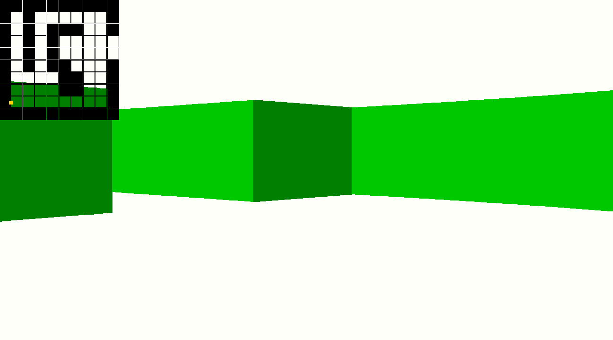
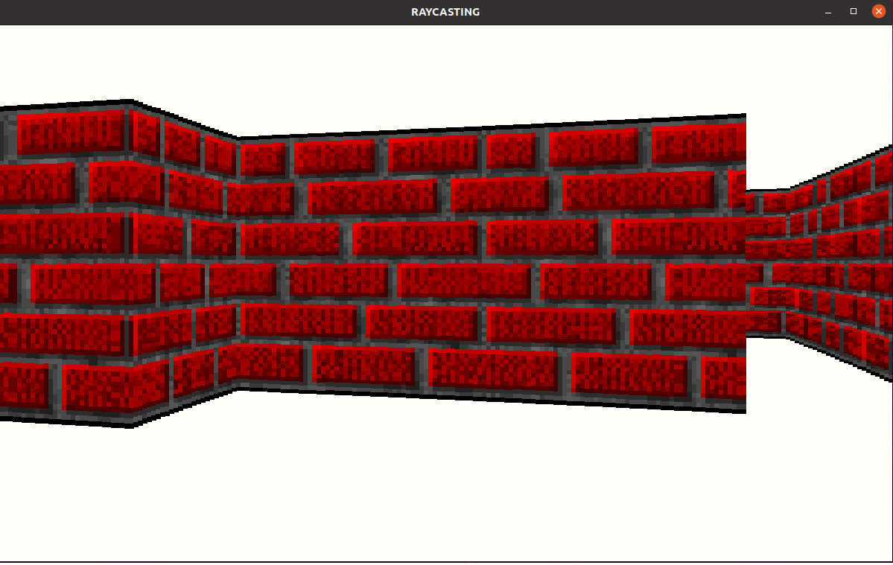

# Raycaster_v2

[](https://svgshare.com/i/Zhy.svg)


Ce projet consiste à mettre en place un moteur de jeu inspiré par Wolfenstein 3d et DOOM.
Le moteur 3D est basé sur la technique du raycasting qui permet d'afficher un environnement 3D à partir d'affichage 2D.
<br>
Il s'agit d'une évolution de mon [premier moteur de raycasting](https://github.com/Rudiio/Raycaster.git) qui permettait un affichage 3D sans optimisation.


## Objectifs

- [x] Mettre en place les calculs de distances optmisés (merci la trigo)
- [x] Afficher l'environnement 3D
- [x] Gérer la minimap
- [x] Texturer les murs
- [x] Améliorer les mouvements
- [ ] Textures le sol
- [ ] Texturer le plafond
- [ ] Afficher des sprites
- [x] Créer une nouvelle map aléatoire
- [ ] Création aléatoire de labyrinthe ou chargement de map via .txt
- [ ] Ajout du tableau de bord 
- [ ] Ajout des portes et map des murs
- [x] Afficher les fps
 

## Dependencies

### SDL Library
Le projet utilise la Bibliothèque graphique [SDL2](https://www.libsdl.org/download-2.0.php).
Son API permet de facilement gérer les affichages ainsi que E/S.
L'extension SDL_image est utilisée pour gérer l'imporation des textures.

Sous Linux : 

```
sudo apt install libsdl2-2.0-0 libsdl2-gfx-1.0-0 libsdl2-image-2.0-0 libsdl2-mixer-2.0-0 libsdl2-net-2.0-0 libsdl2-ttf-2.0-0 libsdl2-dev libsdl2-image-dev libsdl2-ttf-dev
```

## Install 

```
make
```

## Avancée du projet<br>

Le projet permet d'afficher l'environnement 3d avec une précision correcte. Cependant, il y  a un soucis au niveau des coins qui est à corriger.
Le moteur de jeu supporte actuellement les textures sur les murs, il suffit que remplacer l'image ///textures/Wall.png par une image 64*64.
La gestion des mouvements a été améliorée et est fluide.
La  texturation des sols a été en partie implémentée mais le floor casting ralentit trop le programme, donc cette partie a été mise de coté.
La gestion des sprites à été initiée, mais le manque d'information à ce sujet a freiner sa mise en place.
Un générateur de carte aléatoire basique a été implémenté mais il pourrait facielement être amélioré.
Les fps sont affichés en haut à droite de l'écran, mais la mise à jour de l'écriture est trop rapide. Les fps ont étés capés à 60;

### Sans texture


### Avec la texture d'herbe de Minecraft


### Avec la texture de Wolfenstein


## Commandes 

- **M** : Afficher/Cacher la minimap
- **← → ↑ ↓** : Pour se déplacer
- **ESC** : Pour quitter

## A corriger

- Erreurs valgrind lors de l'affichage de la mini-map (semble provenir de la modification du rendu) 
- Problème du raycasting au niveau des coins
- Ralentissements du floorcasting
- Rajout des sprites

## ressources 

- [doom-wolfenstein-raycasting](https://guy-grave.developpez.com/tutoriels/jeux/doom-wolfenstein-raycasting/)

- [Lodev](https://lodev.org/cgtutor/raycasting.html)

- [permadi](https://permadi.com/1996/05/ray-casting-tutorial-table-of-contents/)

- [Make your own raycaster, 3Dsage](https://www.youtube.com/watch?v=gYRrGTC7GtA&t=0s) 

- [Tutoriel pour les jeux vidéos avec la SDL](https://thenumbat.github.io/cpp-course/sdl2/08/08.html#:~:text=Capping%20your%20FPS%20is%20quite,std%3A%3Achrono%20for%20more.))